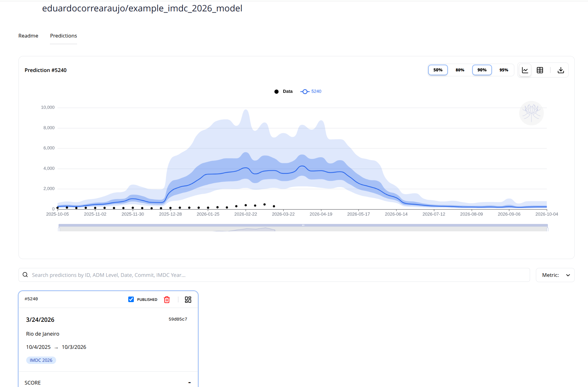

# Submit your predictions using (`mosqlient`)

To submit your predictions using `mosqlient` we will use the function 
`upload_prediction`. This function has the following parameters: 

| Field | Type | Description | Example |
| :--- | :--- | :--- | :--- |
| api_key | string | Your personal API authentication key. | "YOUR_API_KEY" |
| repository | string | The model's repository (owner/name). | "eduardocorrearaujo/imdc_2026" |
| description | string / null | A brief description of your prediction. | "My baseline model" |
| commit | string | Git commit hash of the code version used. | "3d1d2cd016fe38b6e7d517f..." |
| case_definition| string | Set to either "reported" or "probable".| "reported" |
| published | boolean | Set to true to make it publicly visible. | true |
| adm_0 | string | Country ISO code (Defaults to "BRA"). | "BRA" |
| adm_1 | integer | State geocode. | 33 (for RJ) |
| adm_2 | integer | City geocode (IBGE). | 3304557 |
| adm_3 | integer | Sub-municipality geocode. | null |
| prediction | pd.DataFrame | pandas DataFrame containing the columns: "date", "pred", "lower_95","lower_90", "lower_80", "lower_50", "upper_50", "upper_80", "upper_90", "upper_95"| [{...}, {...}] |
 
**About the Location Data (The `adm` fields):** 

You only need to fill out the geographic level your model specifically targets. Leave the others as null.
* State-level model: Fill adm_1, set adm_2 and adm_3 to null.
* City-level model: Fill adm_2, set adm_1 and adm_3 to null.

**Understanding the columns of the prediction dataframe:**
* `date`: The forecast target date (YYYY-MM-DD).
* `pred`: The median (50th percentile) prediction.
* `lower_*` and `upper_*`: These form your prediction intervals. For example, lower_95 (2.5th percentile) and upper_95 (97.5th percentile) create your 95% confidence interval.

Also, to be accepted by the platform, your prediction data must strictly adhere to the following rules:

* **Sunday dates**: The prediction date must fall on a Sunday (for weekly predictions) to match the platform's validation data.
* **Continuous dates**: There can be no gaps in your sequence of dates.
* **Challenge Timeframe**: Your predictions must cover all dates between Epidemiological Week (EW) 41 of the previous year and EW 40 of the target year.
* **Positive Values**: All prediction values must be 0 or greater (no negative numbers).
* **Nested Intervals**: Your intervals must make logical, mathematical sense. The values must increase sequentially exactly like this:
`lower_95` ≤ `lower_90` ≤ `lower_80` ≤ `lower_50` ≤ `pred` ≤ `upper_50` ≤ `upper_80` ≤ `upper_90` ≤ `upper_95`

Import the necessary librarys:

```{r}
library(reticulate)
library(data.table)
```
Config python: 
```{r}
py_config()
```

Get your API_KEY:

```{r}
api_key = "YOUR_API_KEY"
```

Now it is time to install the mosqlient

```{r}
# un/comment if you need to install them
py_require(c("mosqlient"))
mosq <- import("mosqlient")
```

##  Load the example prediction: 

The prediction below is a prediction from the last IMDC edition. It will be used here as an example of how submit a prediction.

```{r, results='hide'}
prediction <- fread("example_prediction.csv")
head(prediction)
```

## Upload prediction

Fill the necessary parameters: 

```{r}
repository <- 'eduardocorrearaujo/example_imdc_2026_model' # fill with your repository name 
description <- 'Example of submitting predictions in the Python tutorial'
commit <- '59d05c7d391273bd0321a94e2509863c1c9f9113'
adm_1 <- 35 # example for SP
adm_2 <- NULL
case_definition <- 'probable' # The IMDC uses probable cases 
published <- T
```

Run the code below to registry the forecast the prediction:

```{r}
mosq$upload_prediction(
                api_key = api_key,
                repository = repository,
                description = description,
                commit = commit,
                adm_1 = adm_1,
                published = published,
                prediction = prediction
)
```

After saving, it will appear in the “Predictions” tab of your model: 


For more details check the [mosqlient documentation](https://mosqlimate-client.readthedocs.io/en/latest/tutorials/API/registry/). If you run into dificulties, please reach out fo help at our [discord server](https://discord.gg/yqtgW4TC)